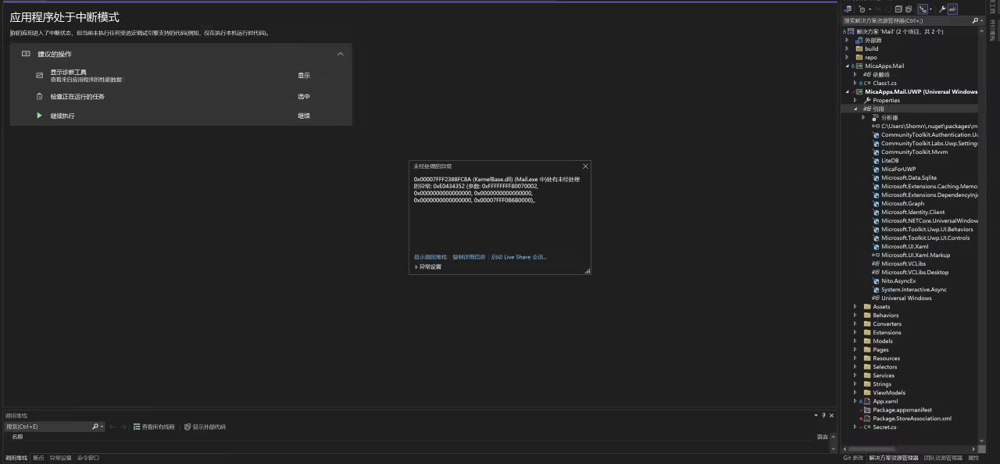
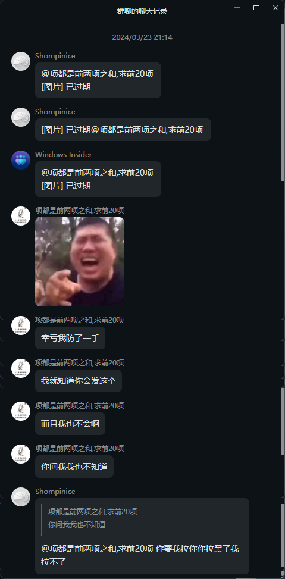
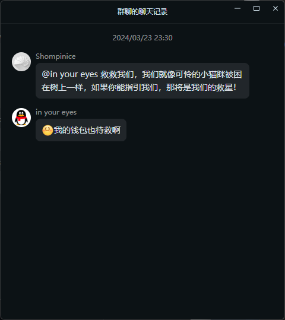
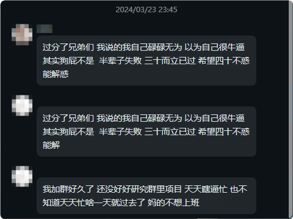
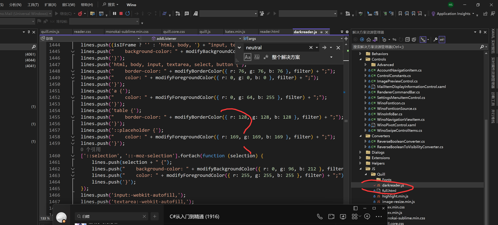
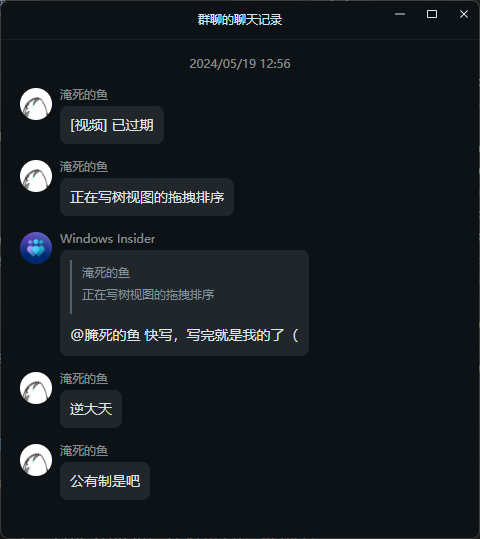
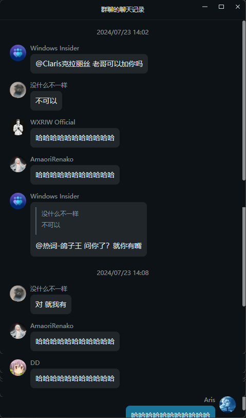
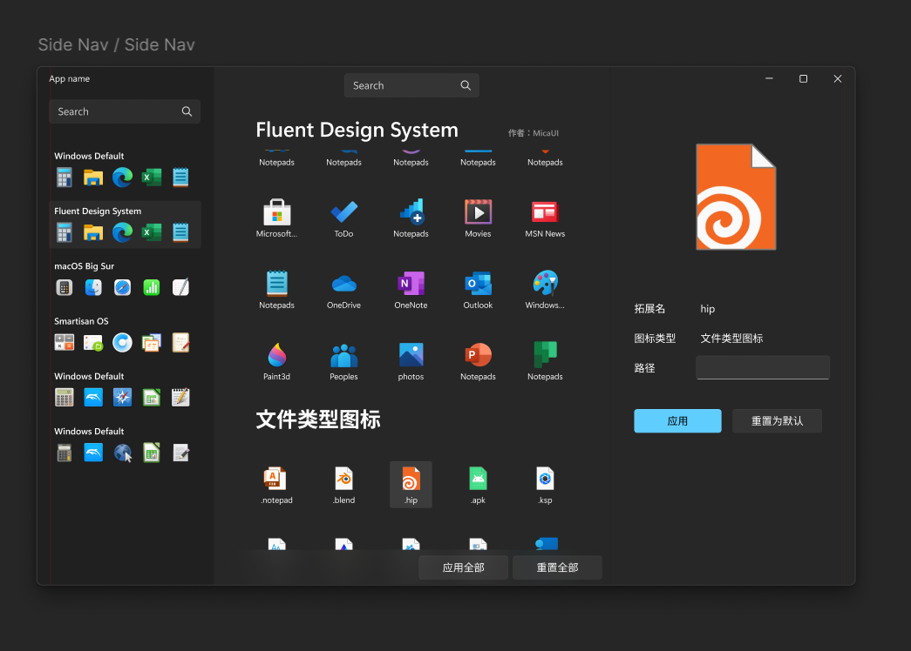
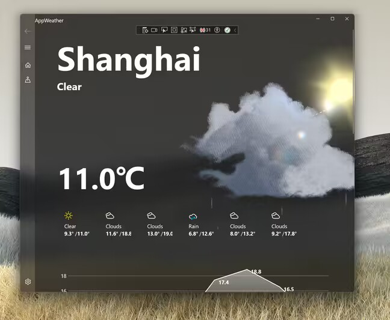

# Ads

- 2024.3.23, about Mail UWP

    求救！！！电邮UWP，Debug 模式下正常，Release 过不去，旁加载无法登录。

    1.Debug模式下正常

    2.Release模式下报这个异常，但没有崩溃，根本进不去WinDbg提示如下

    dump文件夹无内容

    

    3.旁加载模式提示

    仓库地址
    https://github.com/MicaApps/Mail

    我们真的非常需要你的帮助，我们的项目困境重重，就像可怜的小猫咪被困在树上一样。如果你能够加入我们，给予一些指引和支持，那将是我们的救星！请成为我们的好友，一同披荆斩棘吧！
    
    > P.S. 
    >
    >
    >
    >

- 2024.3.23 another

    找WPF/UWP/WinUI3老哥，

    我们的邮件UWP app ，缺少邮件文件夹列表，有愿意贡献的老哥们吗？

    仓库地址

    https://github.com/MicaApps/Mail/tree/dev

    > P.S.

    > 

- 2024.4.4 about C++ WinRT/C#+XAML Island Photo Viewer

    为爱发电，找C++/C#/WPF/UWP/WinUI3老哥

    

    

    微软把照片App整了个大活儿，整成WinUI3就算了，还塞了个WebView2，体积膨胀到了1G+

    有没有老哥愿意一起来搞个C++ WinRT/C#+XAML岛的照片查看器的。

- 2024.5.2 about Webview Plugin

    这是Webview，看起来它用了一个第三方的深色模式插件来反转网页的颜色，但现在难度是，我知道是大概是这个js起作用，但具体在哪儿我定位不到

    

    https://github.com/MicaApps/Wino-Mail

    > P.S.  

- 2024.5.19 Great artist steal

    

- 2024.7.23 Patience is the key of life

    

- 2024.7.23 Icon Pack

    为爱发电，找熟悉 Linux图标包的老哥们。我在搞一个图标包，我还和另一个老哥正在把它做成网站（用于展示），客户端（用于一键修改图标包），但我们都不熟悉 linux
    
    我们都知道……是的，类似这样
    https://www.gnome-look.org/browse/
    
    

    我们真的非常需要你的帮助，我们的项目困境重重，就像可怜的小猫咪被困在树上一样。如果你能够加入我们，给予一些指引和支持，那将是我们的救星！请成为我们的好友，一同披荆斩棘吧！

- 2024.7.29 UWP Weather
    
    为爱发电，找 WPF/UWP/WinUI3老哥

    我们这个天气app，已经成功将Unity整合入UWP中，但城市选择和存储这里有一个二十多兆的JSON，然后一点选择城市就会卡死，求老哥协助。

    

    我们真的非常需要您的帮助，我们这儿可真是热闹非凡，项目宝宝迷了路，就像那迷途的小猫儿，爬上了高高的树梢，喵喵叫得好凄凉~~

    您要是能施展魔法，跳进我们的马戏团，指个明路、搭把手，那您就是我们的大英雄啦！来吧，来吧，戴上彩帽，成为我们的小伙伴，一起闯过这丛丛荆棘，上演一场精彩的大戏哟~！